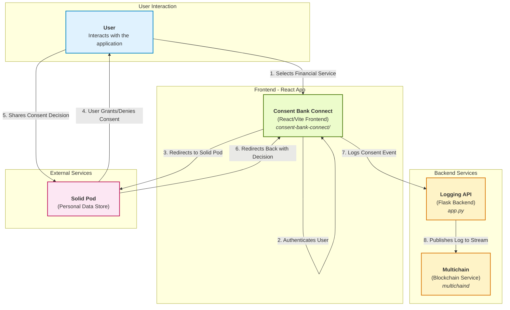

# Digital Consent Management with Multichain

This project demonstrates a robust digital consent management system using a React frontend, a Python (Flask) backend, a Solid Pod for personal data storage, and a Multichain blockchain for immutable logging.

## System Architecture

The system is composed of four main components that interact to create a secure and transparent consent flow:

1.  **Consent Bank Connect (Frontend)**: A React application built with Vite that provides the user interface for selecting services and initiating the consent process.
2.  **Solid Pod (External)**: An external personal data store where the user manages their own data and provides or denies consent for its use.
3.  **Logging API (Backend)**: A Flask server (`app.py`) that receives logging events from the frontend.
4.  **Multichain (Backend)**: A private blockchain (`multichaind`) that stores immutable, auditable logs of all consent events.

### Workflow Diagram



## How to Run the System

To run the complete system, you need to start the three main components in order: Multichain, the Logging API, and the Frontend Application.

### 1. Start the Multichain Service

First, start the multichain daemon for the `logschain`.

```bash
multichaind logschain -daemon
```

### 2. Start the Logging API

The backend is a Flask application that requires a Python virtual environment.

```bash
# Activate the virtual environment
source venv/bin/activate

# Start the Flask server
python app.py
```

The API will run on `http://localhost:5000`.

### 3. Start the Frontend Application

The frontend is a React application managed with npm.

```bash
# Navigate to the frontend directory
cd consent-bank-connect

# Install dependencies (if you haven't already)
npm install

# Start the development server
npm run dev
```

The frontend will be available at `http://localhost:5173` (or another port if 5173 is in use).

### 4. Initialize the Blockchain Stream (One-Time Setup)

If this is the first time you are running the application, you need to initialize the multichain stream and grant permissions.

```bash
# In a new terminal, activate the virtual environment
source venv/bin/activate

# Get the wallet address
ADDRESS=$(multichain-cli logschain listaddresses | jq -r '.[0].address')

# Grant admin permissions to the address
multichain-cli logschain grant $ADDRESS admin

# Run the init-chain command
flask --app app init-chain
```

You are now ready to use the application!

## Project info

**URL**: https://lovable.dev/projects/a87e99cf-bf84-47a4-9e2b-147e4fadf887

## How can I edit this code?

There are several ways of editing your application.

**Use Lovable**

Simply visit the [Lovable Project](https://lovable.dev/projects/a87e99cf-bf84-47a4-9e2b-147e4fadf887) and start prompting.

Changes made via Lovable will be committed automatically to this repo.

**Use your preferred IDE**

If you want to work locally using your own IDE, you can clone this repo and push changes. Pushed changes will also be reflected in Lovable.

The only requirement is having Node.js & npm installed - [install with nvm](https://github.com/nvm-sh/nvm#installing-and-updating)

Follow these steps:

```sh
# Step 1: Clone the repository using the project's Git URL.
git clone <YOUR_GIT_URL>

# Step 2: Navigate to the project directory.
cd <YOUR_PROJECT_NAME>

# Step 3: Install the necessary dependencies.
npm i

# Step 4: Start the development server with auto-reloading and an instant preview.
npm run dev
```

**Edit a file directly in GitHub**

- Navigate to the desired file(s).
- Click the "Edit" button (pencil icon) at the top right of the file view.
- Make your changes and commit the changes.

**Use GitHub Codespaces**

- Navigate to the main page of your repository.
- Click on the "Code" button (green button) near the top right.
- Select the "Codespaces" tab.
- Click on "New codespace" to launch a new Codespace environment.
- Edit files directly within the Codespace and commit and push your changes once you're done.

## What technologies are used for this project?

This project is built with:

- Vite
- TypeScript
- React
- shadcn-ui
- Tailwind CSS

## How can I deploy this project?

Simply open [Lovable](https://lovable.dev/projects/a87e99cf-bf84-47a4-9e2b-147e4fadf887) and click on Share -> Publish.

## Can I connect a custom domain to my Lovable project?

Yes, you can!

To connect a domain, navigate to Project > Settings > Domains and click Connect Domain.

Read more here: [Setting up a custom domain](https://docs.lovable.dev/tips-tricks/custom-domain#step-by-step-guide)
