# Digital Consent Management System

A comprehensive digital consent management system that demonstrates secure, transparent, and user-controlled data sharing between financial services and users through Solid Pods and blockchain logging.

## 🏗️ System Architecture Overview

The system implements a modern consent management architecture with four core components working together to provide secure, auditable, and user-controlled data sharing:

```mermaid
graph TB
    subgraph "User Layer"
        User[👤 End User]
        Browser[🌐 Web Browser]
    end
    
    subgraph "Frontend Layer"
        ReactApp[⚛️ React Application<br/>Consent Bank Connect]
        AuthModal[🔐 Authentication Modal]
        ConsentWaiting[⏳ Consent Waiting Screen]
        SolidPodInterface[📊 Solid Pod Interface]
    end
    
    subgraph "Backend Services"
        FlaskAPI[🐍 Flask API Server<br/>Logging Service]
        AuthService[🔑 Authentication Service]
        BlockchainLogger[⛓️ Blockchain Logger]
    end
    
    subgraph "External Services"
        SolidPod[🗄️ Solid Pod<br/>Personal Data Store]
        Multichain[🔗 Multichain<br/>Blockchain Network]
    end
    
    User --> Browser
    Browser --> ReactApp
    ReactApp --> AuthModal
    ReactApp --> ConsentWaiting
    ReactApp --> SolidPodInterface
    ReactApp --> FlaskAPI
    FlaskAPI --> AuthService
    FlaskAPI --> BlockchainLogger
    SolidPodInterface --> SolidPod
    BlockchainLogger --> Multichain
    
    classDef userLayer fill:#e1f5fe,stroke:#01579b,stroke-width:2px
    classDef frontendLayer fill:#f3e5f5,stroke:#4a148c,stroke-width:2px
    classDef backendLayer fill:#e8f5e8,stroke:#1b5e20,stroke-width:2px
    classDef externalLayer fill:#fff3e0,stroke:#e65100,stroke-width:2px
    
    class User,Browser userLayer
    class ReactApp,AuthModal,ConsentWaiting,SolidPodInterface frontendLayer
    class FlaskAPI,AuthService,BlockchainLogger backendLayer
    class SolidPod,Multichain externalLayer
```



## 🎯 Digital Consent Framework Components

### Framework Overview Chart

```mermaid
graph TB
    subgraph "Third-Party Applications"
        BankApp[🏦 Bank Application<br/>Example: SecureBank<br/>Requests user data access]
        OtherApps[📱 Other Third-Party Apps<br/>Insurance, Healthcare, etc.]
    end
    
    subgraph "ConsentFlow Intermediate Layer"
        ConsentRouter[🔄 ConsentFlow Router<br/>Manages routing between apps<br/>and Solid Pods]
        AuthManager[🔐 Authentication Manager<br/>Handles user verification]
        ConsentValidator[✅ Consent Validator<br/>Validates consent requests]
        EventLogger[📝 Event Logger<br/>Records all consent activities]
    end
    
    subgraph "Solid Pod Ecosystem"
        SolidPod[🗄️ Solid Pod<br/>Personal Data Container<br/>User-controlled storage]
        ConsentApp[📋 Consent Management App<br/>Give/Revoke permissions<br/>Data field selection]
        DataStore[💾 Personal Data Store<br/>Encrypted user data<br/>Structured by categories]
    end
    
    subgraph "Blockchain Audit Layer"
        Multichain[⛓️ Multichain Blockchain<br/>Immutable consent logs<br/>GDPR compliance records]
        AuditTrail[📊 Audit Trail<br/>Complete consent history<br/>Regulatory compliance]
    end
    
    BankApp --> ConsentRouter
    OtherApps --> ConsentRouter
    ConsentRouter --> AuthManager
    ConsentRouter --> ConsentValidator
    ConsentRouter --> SolidPod
    SolidPod --> ConsentApp
    ConsentApp --> DataStore
    ConsentValidator --> EventLogger
    EventLogger --> Multichain
    Multichain --> AuditTrail
    
    classDef thirdParty fill:#ffebee,stroke:#c62828,stroke-width:2px
    classDef consentFlow fill:#e3f2fd,stroke:#1565c0,stroke-width:2px
    classDef solidPod fill:#e8f5e8,stroke:#2e7d32,stroke-width:2px
    classDef blockchain fill:#fff3e0,stroke:#ef6c00,stroke-width:2px
    
    class BankApp,OtherApps thirdParty
    class ConsentRouter,AuthManager,ConsentValidator,EventLogger consentFlow
    class SolidPod,ConsentApp,DataStore solidPod
    class Multichain,AuditTrail blockchain
```



### Component Interaction Flow

```mermaid
sequenceDiagram
    participant Bank as 🏦 Bank App
    participant Router as 🔄 ConsentFlow Router
    participant Auth as 🔐 Auth Manager
    participant Pod as 🗄️ Solid Pod
    participant Consent as 📋 Consent App
    participant Logger as 📝 Event Logger
    participant Chain as ⛓️ Blockchain
    
    Bank->>Router: Request user data access
    Router->>Auth: Authenticate user
    Auth-->>Router: User verified
    Router->>Pod: Redirect to consent interface
    Pod->>Consent: Show data selection interface
    Consent->>Consent: User selects data fields
    Consent->>Consent: User grants/denies consent
    Consent->>Logger: Log consent decision
    Logger->>Chain: Store immutable record
    Chain-->>Logger: Transaction confirmed
    Consent-->>Router: Return consent result
    Router-->>Bank: Provide access/deny access
    
    Note over Bank,Chain: Complete GDPR-compliant consent flow
```



## 🏦 Third-Party Application (Bank App Example)

### Bank Application Architecture

```mermaid
graph LR
    subgraph "SecureBank Application"
        UI[🎨 User Interface<br/>Service selection<br/>Account management]
        Auth[🔐 Authentication<br/>User login<br/>Session management]
        API[🌐 API Client<br/>Data requests<br/>Service integration]
        Storage[💾 Local Storage<br/>User preferences<br/>Session data]
    end
    
    subgraph "Bank Services"
        Banking[🏦 Banking Services<br/>Account management<br/>Transactions]
        Investment[📈 Investment Services<br/>Portfolio management<br/>Trading]
        Credit[💳 Credit Services<br/>Loans<br/>Credit cards]
    end
    
    UI --> Auth
    UI --> API
    Auth --> Storage
    API --> Banking
    API --> Investment
    API --> Credit
    
    classDef bankApp fill:#e8f5e8,stroke:#2e7d32,stroke-width:2px
    classDef services fill:#fff3e0,stroke:#ef6c00,stroke-width:2px
    
    class UI,Auth,API,Storage bankApp
    class Banking,Investment,Credit services
```



### Bank App Data Request Flow


## 🔄 ConsentFlow Intermediate Application

### ConsentFlow Router Architecture

```mermaid
graph TB
    subgraph "ConsentFlow Router"
        RequestHandler[📥 Request Handler<br/>Receives data requests<br/>Validates requests]
        AuthService[🔐 Authentication Service<br/>User verification<br/>Session management]
        ConsentManager[📋 Consent Manager<br/>Manages consent flows<br/>Validates permissions]
        Router[🔄 Router<br/>Routes to appropriate<br/>Solid Pods]
        Logger[📝 Logger<br/>Records all activities<br/>GDPR compliance]
    end
    
    subgraph "External Integrations"
        ThirdPartyApps[📱 Third-Party Apps<br/>Bank, Insurance, etc.]
        SolidPods[🗄️ Solid Pods<br/>User data stores]
        Blockchain[⛓️ Blockchain<br/>Audit trail]
    end
    
    ThirdPartyApps --> RequestHandler
    RequestHandler --> AuthService
    RequestHandler --> ConsentManager
    ConsentManager --> Router
    Router --> SolidPods
    Logger --> Blockchain
    
    classDef consentFlow fill:#e3f2fd,stroke:#1565c0,stroke-width:2px
    classDef external fill:#fff3e0,stroke:#ef6c00,stroke-width:2px
    
    class RequestHandler,AuthService,ConsentManager,Router,Logger consentFlow
    class ThirdPartyApps,SolidPods,Blockchain external
```



### ConsentFlow Routing Logic


## 🗄️ Solid Pod - Personal Data Container

### Solid Pod Architecture


### Solid Pod Consent Management Flow


## ⛓️ Blockchain - GDPR Compliance Audit Trail

### Blockchain Architecture for Consent Logging

```mermaid
graph TB
    subgraph "Multichain Network"
        Nodes[🖥️ Network Nodes<br/>Distributed validation<br/>Consensus mechanism]
        Streams[📊 Data Streams<br/>Consent events<br/>Audit records]
        Wallets[👛 Digital Wallets<br/>User identities<br/>Transaction signing]
    end
    
    subgraph "Consent Event Types"
        DataRequest[📥 Data Request Events<br/>Third-party requests]
        ConsentGranted[✅ Consent Granted Events<br/>User permissions given]
        ConsentDenied[❌ Consent Denied Events<br/>User permissions denied]
        ConsentRevoked[🔄 Consent Revoked Events<br/>Permissions withdrawn]
        DataAccess[👁️ Data Access Events<br/>Actual data usage]
    end
    
    subgraph "GDPR Compliance"
        LegalBasis[⚖️ Legal Basis Tracking<br/>Article 6 compliance]
        PurposeLimitation[🎯 Purpose Limitation<br/>Specific use cases]
        DataMinimization[📏 Data Minimization<br/>Minimal data sharing]
        RetentionPeriod[⏰ Retention Periods<br/>Data lifecycle management]
        RightToBeForgotten[🗑️ Right to be Forgotten<br/>Data deletion requests]
    end
    
    Nodes --> Streams
    Streams --> Wallets
    DataRequest --> LegalBasis
    ConsentGranted --> PurposeLimitation
    ConsentDenied --> DataMinimization
    ConsentRevoked --> RightToBeForgotten
    DataAccess --> RetentionPeriod
    
    classDef blockchain fill:#fff3e0,stroke:#ef6c00,stroke-width:2px
    classDef events fill:#e3f2fd,stroke:#1565c0,stroke-width:2px
    classDef gdpr fill:#e8f5e8,stroke:#2e7d32,stroke-width:2px
    
    class Nodes,Streams,Wallets blockchain
    class DataRequest,ConsentGranted,ConsentDenied,ConsentRevoked,DataAccess events
    class LegalBasis,PurposeLimitation,DataMinimization,RetentionPeriod,RightToBeForgotten gdpr
```



### Blockchain Event Schema

```json
{
  "eventId": "consent_2024_001",
  "timestamp": "2024-01-15T10:30:00Z",
  "eventType": "consent_granted",
  "user": {
    "userId": "user_12345",
    "pseudonym": "anon_abc123"
  },
  "thirdParty": {
    "appId": "securebank_001",
    "appName": "SecureBank",
    "serviceType": "personal_banking"
  },
  "consent": {
    "dataFields": ["name", "email", "phone"],
    "purpose": "Account creation and verification",
    "legalBasis": "GDPR_Article_6_1a",
    "retentionPeriod": "7_years",
    "scope": "account_management"
  },
  "gdprCompliance": {
    "explicitConsent": true,
    "dataMinimization": true,
    "purposeLimitation": true,
    "storageLimitation": true,
    "rightToWithdraw": true
  },
  "blockchain": {
    "transactionId": "tx_abc123def456",
    "blockHash": "0x1234567890abcdef",
    "blockNumber": 12345,
    "gasUsed": 21000
  }
}
```

### GDPR Compliance Tracking


## 🔄 Complete Framework Integration

### End-to-End Data Flow

```mermaid
graph TB
    subgraph "1. Third-Party App"
        BankApp[🏦 SecureBank<br/>Requests user data]
    end
    
    subgraph "2. ConsentFlow Router"
        Router[🔄 ConsentFlow<br/>Routes request]
        Auth[🔐 Authenticates user]
        Validator[✅ Validates request]
    end
    
    subgraph "3. Solid Pod"
        Pod[🗄️ User's Solid Pod<br/>Personal data store]
        ConsentApp[📋 Consent interface<br/>Data field selection]
        DataStore[💾 Encrypted data<br/>User-controlled]
    end
    
    subgraph "4. Blockchain Audit"
        Logger[📝 Event logger<br/>Records activities]
        Blockchain[⛓️ Multichain<br/>Immutable logs]
        Audit[📊 Audit trail<br/>GDPR compliance]
    end
    
    BankApp --> Router
    Router --> Auth
    Router --> Validator
    Validator --> Pod
    Pod --> ConsentApp
    ConsentApp --> DataStore
    Validator --> Logger
    Logger --> Blockchain
    Blockchain --> Audit
    
    classDef app fill:#ffebee,stroke:#c62828,stroke-width:2px
    classDef router fill:#e3f2fd,stroke:#1565c0,stroke-width:2px
    classDef pod fill:#e8f5e8,stroke:#2e7d32,stroke-width:2px
    classDef blockchain fill:#fff3e0,stroke:#ef6c00,stroke-width:2px
    
    class BankApp app
    class Router,Auth,Validator router
    class Pod,ConsentApp,DataStore pod
    class Logger,Blockchain,Audit blockchain
```



### Framework Benefits

| Component | Benefit | GDPR Compliance |
|-----------|---------|-----------------|
| **Third-Party Apps** | Standardized data access | Article 6(1)(a) - Explicit consent |
| **ConsentFlow Router** | Centralized consent management | Article 7 - Conditions for consent |
| **Solid Pod** | User-controlled data storage | Article 20 - Data portability |
| **Blockchain** | Immutable audit trail | Article 30 - Records of processing |

## 🔄 Complete Workflow Schema

### 1. Service Selection & Authentication Flow


### 2. Solid Pod Consent Flow


## 📊 Data Flow Schema

### Consent Event Data Structure

```json
{
  "event": "consent_provided|consent_declined|data_request",
  "service": "Personal Banking|Investment Services|Credit Solutions",
  "serviceId": "personal-banking|investment|credit-solutions",
  "timestamp": "2024-01-15T10:30:00Z",
  "userData": {
    "sharedFields": ["name", "email", "phone"],
    "requiredFields": ["name", "email"],
    "hasRequired": true
  },
  "metadata": {
    "reason": "GDPR Article 6(1)(a) - Explicit consent",
    "purpose": "Financial service provision",
    "retention": "7 years"
  }
}
```

### Data Field Categories

```typescript
interface DataField {
  id: string;           // Unique identifier
  label: string;        // Human-readable name
  description: string;  // Purpose explanation
  required: boolean;    // Mandatory for service
  category: 'basic' | 'contact' | 'personal' | 'professional';
}

const dataFields = [
  // Basic Information
  { id: 'name', label: 'Full Name', required: true, category: 'basic' },
  
  // Contact Details
  { id: 'email', label: 'Email Address', required: true, category: 'contact' },
  { id: 'phone', label: 'Mobile Number', required: false, category: 'contact' },
  { id: 'address', label: 'Residential Address', required: false, category: 'contact' },
  
  // Personal Information
  { id: 'dateOfBirth', label: 'Date of Birth', required: false, category: 'personal' },
  { id: 'maritalStatus', label: 'Marital Status', required: false, category: 'personal' },
  
  // Professional Information
  { id: 'jobPosition', label: 'Job Position', required: false, category: 'professional' },
  { id: 'employer', label: 'Employer', required: false, category: 'professional' },
  { id: 'income', label: 'Annual Income', required: false, category: 'professional' }
];
```

## 🏛️ Component Architecture

### Frontend Components Structure

```
src/
├── components/
│   ├── AuthModal.tsx          # Authentication interface
│   ├── ConsentWaiting.tsx     # Loading state during consent
│   └── ui/                    # Reusable UI components
│       ├── button.tsx
│       ├── card.tsx
│       ├── checkbox.tsx
│       └── ... (shadcn/ui components)
├── pages/
│   ├── Index.tsx              # Main banking interface
│   ├── SolidPodInterface.tsx  # Consent management interface
│   └── NotFound.tsx           # 404 page
├── lib/
│   ├── logger.ts              # Event logging service
│   ├── reasons.ts             # GDPR compliance reasons
│   └── utils.ts               # Utility functions
└── hooks/
    ├── use-mobile.tsx         # Mobile detection
    └── use-toast.ts           # Notification system
```

### Backend Services Structure

```
services/
├── auth_service.py            # Authentication logic
├── blockchain_service.py      # Multichain integration
└── consent_service.py         # Consent validation

routes/
├── __init__.py
├── auth.py                    # Authentication endpoints
├── consent.py                 # Consent management endpoints
└── logs.py                    # Event logging endpoints

models/
├── __init__.py
├── user.py                    # User data models
├── consent.py                 # Consent record models
└── event.py                   # Event logging models
```

## 🔐 Security & Privacy Schema

### Authentication Flow


### Data Protection Layers

1. **Transport Layer Security (TLS)**
   - All communications encrypted with HTTPS
   - Secure WebSocket connections for real-time updates

2. **Authentication & Authorization**
   - Multi-factor authentication support
   - Role-based access control (RBAC)
   - Session management with secure tokens

3. **Data Privacy**
   - GDPR-compliant consent management
   - Data minimization principles
   - Right to be forgotten implementation

4. **Audit Trail**
   - Immutable blockchain logging
   - Comprehensive event tracking
   - Regulatory compliance reporting

## 🚀 Technology Stack

### Frontend Technologies
- **React 18** - Modern UI framework with hooks
- **TypeScript** - Type-safe development
- **Vite** - Fast build tool and dev server
- **Tailwind CSS** - Utility-first styling
- **shadcn/ui** - High-quality component library
- **React Router** - Client-side routing
- **React Query** - Server state management

### Backend Technologies
- **Python 3.11+** - Backend runtime
- **Flask** - Lightweight web framework
- **Multichain** - Private blockchain for logging
- **SQLAlchemy** - Database ORM (if implemented)
- **JWT** - Token-based authentication

### External Integrations
- **Solid Pod** - Personal data storage
- **Multichain** - Blockchain logging service
- **REST APIs** - Service communication

## 📋 Installation & Setup

### Prerequisites
- Node.js 18+ and npm
- Python 3.11+
- Multichain installation
- Modern web browser

### Quick Start

1. **Clone and Install Dependencies**
```bash
git clone <repository-url>
cd digital_consent
npm install
```

2. **Set Up Python Environment**
```bash
python -m venv venv
source venv/bin/activate  # On Windows: venv\Scripts\activate
pip install -r requirements.txt
```

3. **Start Multichain Service**
```bash
multichaind logschain -daemon
```

4. **Initialize Blockchain Stream**
```bash
# Get wallet address
ADDRESS=$(multichain-cli logschain listaddresses | jq -r '.[0].address')
# Grant admin permissions
multichain-cli logschain grant $ADDRESS admin
# Initialize stream
flask --app app init-chain
```

5. **Start Backend API**
```bash
python app.py
```

6. **Start Frontend Development Server**
```bash
npm run dev
```

### Environment Configuration

Create a `.env` file in the root directory:

```env
# API Configuration
API_BASE_URL=http://localhost:5000
FRONTEND_URL=http://localhost:5173

# Blockchain Configuration
MULTICHAIN_RPC_HOST=localhost
MULTICHAIN_RPC_PORT=9544
MULTICHAIN_RPC_USER=multichainrpc
MULTICHAIN_RPC_PASSWORD=your_password

# Authentication
JWT_SECRET_KEY=your_secret_key
SESSION_SECRET=your_session_secret

# Solid Pod Configuration
SOLID_POD_PROVIDER=https://your-pod-provider.com
```

## 🧪 Testing the System

### Manual Testing Flow

1. **Access the Application**
   - Navigate to `http://localhost:5173`
   - Verify the banking interface loads correctly

2. **Select a Service**
   - Choose "Personal Banking", "Investment Services", or "Credit Solutions"
   - Verify authentication modal appears

3. **Complete Authentication**
   - Enter test credentials
   - Verify successful authentication

4. **Test Consent Flow**
   - Verify redirect to Solid Pod interface
   - Select/deselect data fields
   - Test both consent and decline scenarios

5. **Verify Blockchain Logging**
   - Check Multichain logs for consent events
   - Verify event data structure

### Automated Testing

```bash
# Frontend tests
npm run test

# Backend tests
python -m pytest tests/

# Integration tests
npm run test:integration
```

## 📈 Monitoring & Analytics

### Event Tracking Schema

```typescript
interface ConsentEvent {
  eventType: 'consent_provided' | 'consent_declined' | 'data_request';
  serviceId: string;
  userId?: string;
  timestamp: string;
  dataFields: string[];
  gdprReason: string;
  blockchainTxId?: string;
}
```

### Key Metrics

- **Consent Rate**: Percentage of successful consents
- **Data Field Usage**: Most/least shared data fields
- **Service Popularity**: Most requested services
- **Blockchain Performance**: Transaction success rates
- **User Experience**: Time to complete consent flow

## 🔧 Development Guidelines

### Code Style
- **Frontend**: ESLint + Prettier configuration
- **Backend**: Black + isort for Python formatting
- **TypeScript**: Strict mode enabled
- **React**: Functional components with hooks

### Git Workflow
1. Feature branches from `main`
2. Pull request reviews required
3. Automated testing on CI/CD
4. Semantic versioning for releases

### API Documentation
- OpenAPI/Swagger specification
- Interactive API documentation
- Postman collection for testing

## 📚 Additional Resources

- [Solid Pod Documentation](https://solidproject.org/)
- [Multichain Documentation](https://www.multichain.com/)
- [GDPR Compliance Guide](https://gdpr.eu/)
- [React Best Practices](https://react.dev/)
- [Flask Documentation](https://flask.palletsprojects.com/)

## 🤝 Contributing

1. Fork the repository
2. Create a feature branch
3. Make your changes
4. Add tests for new functionality
5. Submit a pull request

## 📄 License

This project is licensed under the MIT License - see the [LICENSE](LICENSE) file for details.

## 🆘 Support

For support and questions:
- Create an issue in the repository
- Check the documentation
- Review the troubleshooting guide

---

**Note**: This is a demonstration system. For production use, implement proper security measures, error handling, and compliance with local regulations. 